# Backend Replication Flow

This document describes the backend flow for the MySQL binlog replicator. It covers application startup, snapshotting, realtime CDC, DDL/DML application, checkpointing, verification, monitoring APIs, and operational failure behavior.

The backend is a standalone Spring Boot service. It copies a MySQL source database into a MySQL sink database and then keeps the sink updated by reading the source MySQL binary log directly. It does not use Kafka, Debezium, or an external queue.

## 1. High-Level Architecture

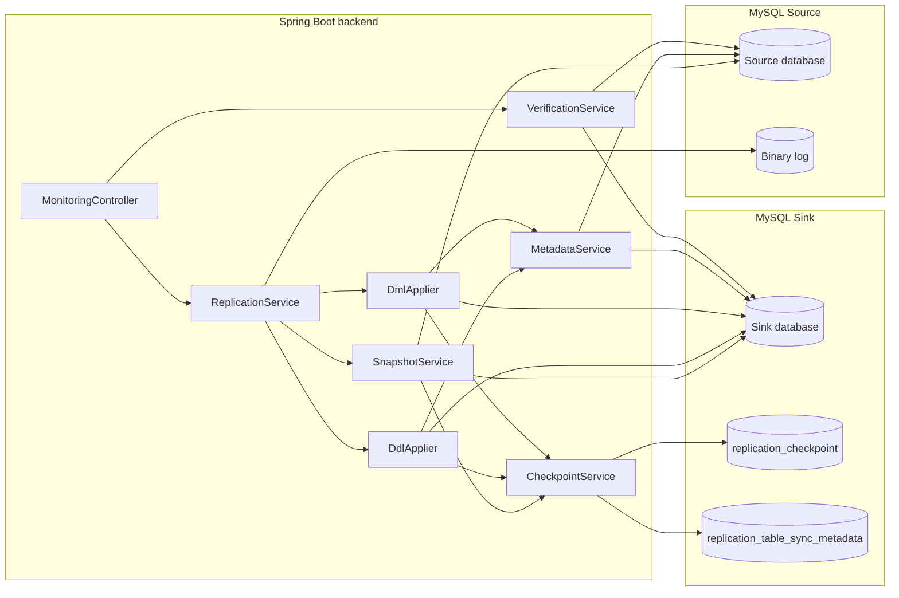

Core responsibilities:

- `ReplicationService`: owns lifecycle, pause/resume state, binlog connection, event routing, and transaction buffering.
- `SnapshotService`: creates the sink schema and copies existing source data when no checkpoint exists.
- `DdlApplier`: maps and applies supported DDL events to the sink.
- `DmlApplier`: applies row-level insert, update, and delete events inside sink transactions.
- `MetadataService`: loads table metadata, creates missing sink tables, and widens sink columns in relaxed mode.
- `DdlSanitizer`: converts source DDL into sink-safe strict or relaxed DDL.
- `CheckpointService`: stores the global resume checkpoint, table-level metadata, and runtime status.
- `VerificationService`: compares source and sink tables by row count and checksum.
- `MonitoringController`: exposes health, status, verification, pause, and resume endpoints.

## 2. Backend Entry Points

The backend exposes these HTTP endpoints:

| Endpoint | Auth | Purpose |
| --- | --- | --- |
| `GET /health` | No | Liveness check. Returns `{"status":"UP"}`. |
| `GET /auth/me` | Yes | Returns the authenticated username. |
| `GET /replication/status` | Yes | Returns the current replication status from `CheckpointService`. |
| `POST /replication/pause` | Yes | Pauses replication and disconnects the binlog client. |
| `POST /replication/resume` | Yes | Starts or resumes replication. |
| `GET /replication/verify?table=<name>&limit=<n>` | Yes | Verifies one table. |
| `GET /replication/verify/all?limit=<n>` | Yes | Verifies all included tables. |

Security behavior:

- `/health` is public.
- Every other endpoint requires HTTP Basic authentication.
- Sessions are stateless and CSRF is disabled because the backend is API-oriented.

## 3. Startup Flow

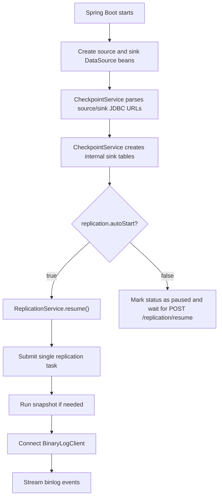

Important details:

- Replication runs on a single-thread executor so binlog order is preserved.
- `replication.autoStart` defaults to `false`, so the service normally waits for an authenticated resume request.
- The sink internal tables are created on startup before replication begins.
- Runtime status is kept in memory by `CheckpointService` and refreshed as replication state changes.

## 4. Internal Tables

### `replication_checkpoint`

This table stores the single global resume point for the whole source database.

Purpose:

- Keeps binlog file and position when file/position resume is used.
- Keeps GTID set when GTID resume is used.
- Stores the last event type, table, and event time.
- Advances only after the corresponding sink DDL or DML transaction succeeds.

The backend always resumes from this table, not from per-table metadata.

### `replication_table_sync_metadata`

This table stores operational visibility per source table.

Purpose:

- Tracks snapshot status: `RUNNING`, `COMPLETED`, or `FAILED`.
- Stores copied row count for snapshot operations.
- Stores last applied table-level binlog metadata.
- Stores the last table-level error or verification mismatch.

This table is useful for dashboards and troubleshooting, but it does not control global binlog ordering.

## 5. Resume Decision Flow

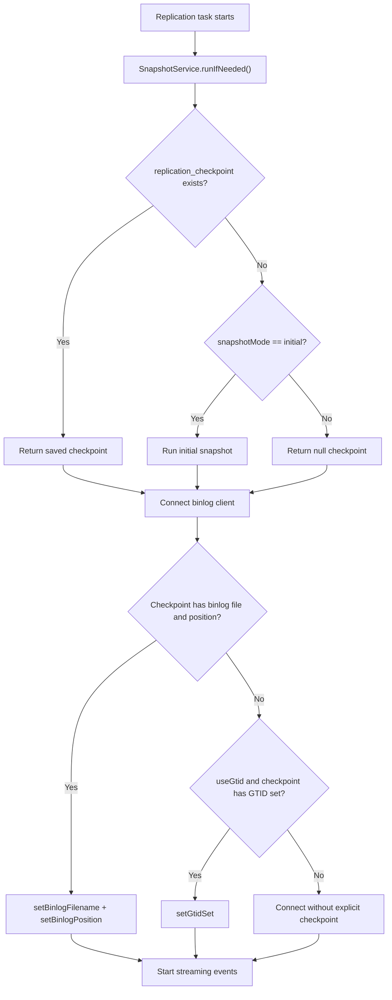

Resume behavior:

- If a checkpoint exists, the backend resumes from it.
- If no checkpoint exists and `snapshotMode=initial`, the backend snapshots the source first.
- If no checkpoint exists and snapshot mode is not `initial`, the binlog client connects without a saved checkpoint.
- File/position resume is preferred when both binlog file and position are present.
- GTID resume is used when configured and a GTID set is available.

## 6. Initial Snapshot Flow

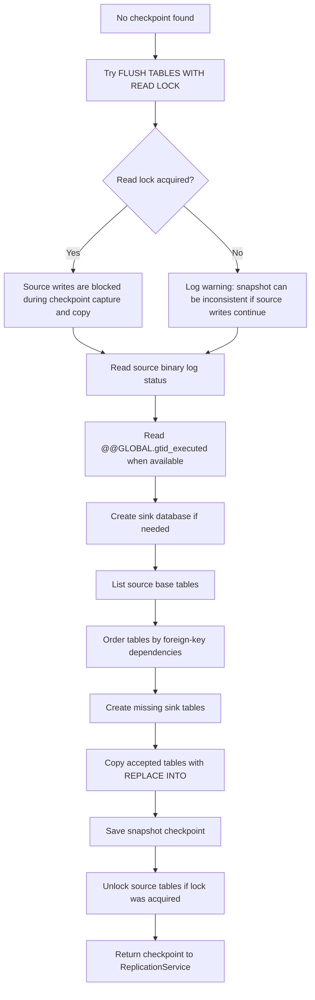

Detailed behavior:

1. `CheckpointService.load()` checks whether a global checkpoint already exists.
2. If there is no checkpoint and `snapshotMode=initial`, snapshot begins.
3. `SnapshotService` tries `FLUSH TABLES WITH READ LOCK`.
4. It reads the source binlog file/position using `SHOW BINARY LOG STATUS`, with fallback to `SHOW MASTER STATUS`.
5. It reads `@@GLOBAL.gtid_executed` when GTID is available.
6. It creates the sink database if needed.
7. It lists source base tables and sorts them by foreign-key dependency.
8. It creates each accepted sink table from source `SHOW CREATE TABLE`.
9. It copies rows table by table using streamed source reads and batched sink writes.
10. It marks each table snapshot as started, completed, or failed in `replication_table_sync_metadata`.
11. It saves the snapshot checkpoint after copy finishes.
12. It releases the source read lock if it was acquired.

The source read lock matters because the snapshot checkpoint must match the copied source state. If the source user cannot acquire the lock, the backend still continues, but concurrent source writes can make the initial snapshot inconsistent.

## 7. Table Filtering

Filtering is handled by `TableFilter`.

Rules:

- If `includeTables` is empty, every source table is included unless excluded.
- If `includeTables` has values, only listed tables are included.
- `excludeTables` removes tables from replication.
- Internal tables should be excluded if they exist in the source database.

Example:

```yaml
replication:
  includeTables: []
  excludeTables:
    - flyway_schema_history
    - replication_checkpoint
    - replication_table_sync_metadata
```

Filtering is applied during both snapshot and realtime row-event handling.

## 8. Realtime Binlog Event Flow

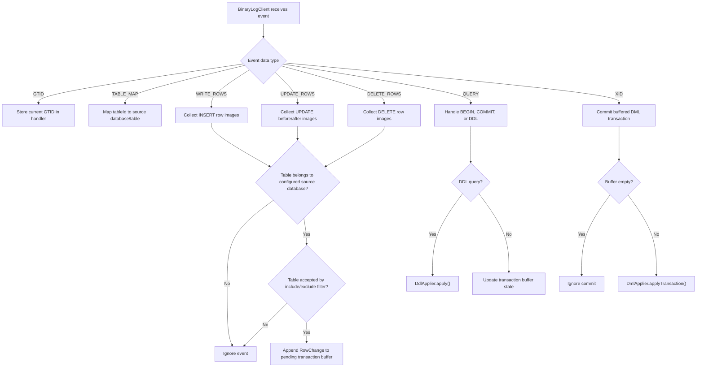

Important behavior:

- `TABLE_MAP` events are required to resolve row events from table IDs to table names.
- Row events from other databases are ignored.
- Row changes are buffered until the transaction commit event.
- `BEGIN` clears the pending transaction buffer.
- `COMMIT` or `XID` causes the buffered row changes to be applied atomically.
- If pause is requested, the handler disconnects the binlog client.

## 9. DML Apply Flow

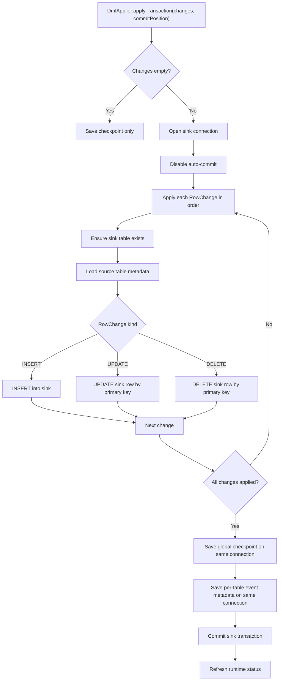

Transaction guarantees:

- Row changes and checkpoint update share the same sink transaction.
- If any row fails, the sink transaction is rolled back.
- The global checkpoint is not advanced when DML apply fails.
- Failed tables are marked with `last_error` when table context is available.

Insert behavior:

- Default `onDuplicateInsert=upsert` adds `ON DUPLICATE KEY UPDATE`.
- This makes replay safer if the same insert is seen again after restart or retry.

Update behavior:

- Updates use primary keys in the `WHERE` clause.
- Non-primary-key columns are updated from the after image.
- If no row is affected, the backend applies the after image as an insert/upsert.

Delete behavior:

- Deletes use primary keys in the `WHERE` clause.
- If no row is affected, the backend logs a warning and continues.

Primary key requirement:

- `UPDATE` and `DELETE` require a primary key by default.
- This is controlled by `replication.requirePrimaryKey`.
- Without a primary key, row updates and deletes are ambiguous on the sink.

## 10. DML Recovery Flow

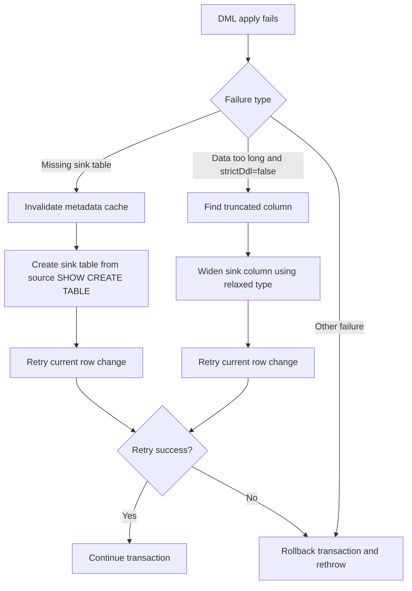

The recovery logic exists because relaxed DDL mode intentionally simplifies the sink schema. If a sink table is missing or a column is too narrow, the backend can repair the sink schema once and retry the current event inside the same overall apply attempt.

## 11. DDL Apply Flow

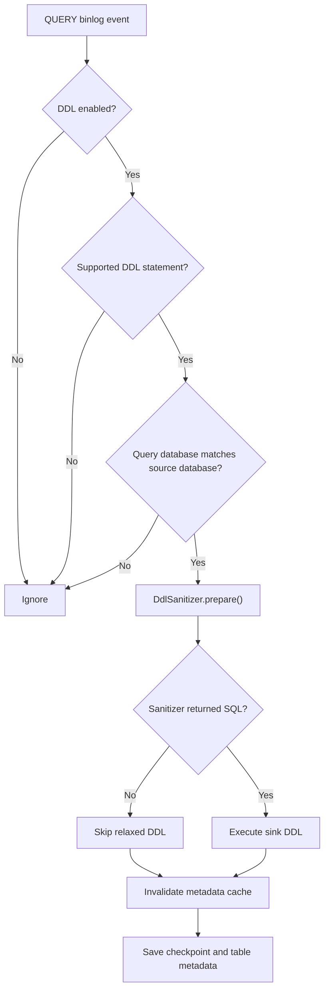

Supported DDL prefixes:

- `CREATE TABLE`
- `ALTER TABLE`
- `DROP TABLE`
- `RENAME TABLE`
- `TRUNCATE TABLE`
- `CREATE INDEX`
- `DROP INDEX`

Failure behavior:

- If DDL execution succeeds, metadata cache is invalidated and checkpoint is advanced.
- If relaxed mode skips index/constraint-only DDL, checkpoint is still advanced.
- If `CREATE TABLE` fails because the sink table already exists, the event is skipped and checkpointed.
- Other DDL failures stop replication and leave the checkpoint unchanged.

## 12. Strict vs Relaxed DDL

### `strictDdl=true`

Strict mode maps the source database name to the sink database name and applies DDL as closely as possible to the source.

Use strict mode when the sink must preserve source constraints and indexes exactly.

Tradeoffs:

- Foreign keys, unique constraints, and existing sink objects can block replication.
- DDL failures stop the pipeline.
- The checkpoint is not advanced on failure.

### `strictDdl=false`

Relaxed mode is the default. It intentionally makes the sink schema easier to write into.

Relaxed `CREATE TABLE` behavior:

- Keeps writable source columns.
- Keeps the primary key.
- Widens non-primary-key text-like columns to `longtext`.
- Widens non-primary-key binary/blob columns to `longblob`.
- Skips generated columns.
- Removes defaults, `ON UPDATE`, `AUTO_INCREMENT`, `NOT NULL`, column comments, and per-column charset/collation.
- Removes foreign keys, unique constraints, secondary indexes, fulltext/spatial indexes, and checks.
- Removes table options such as `ENGINE`, `AUTO_INCREMENT`, default charset, and default collation.

Relaxed DDL event behavior:

- Index-only and constraint-only DDL can be skipped and checkpointed.
- Column-changing DDL is still applied.
- Sink columns can be widened later if DML detects a truncation error.

Relaxed mode is best for a backup, reporting, analytics, or operational mirror sink where data sync is more important than enforcing every source-side constraint.

## 13. Checkpoint Flow

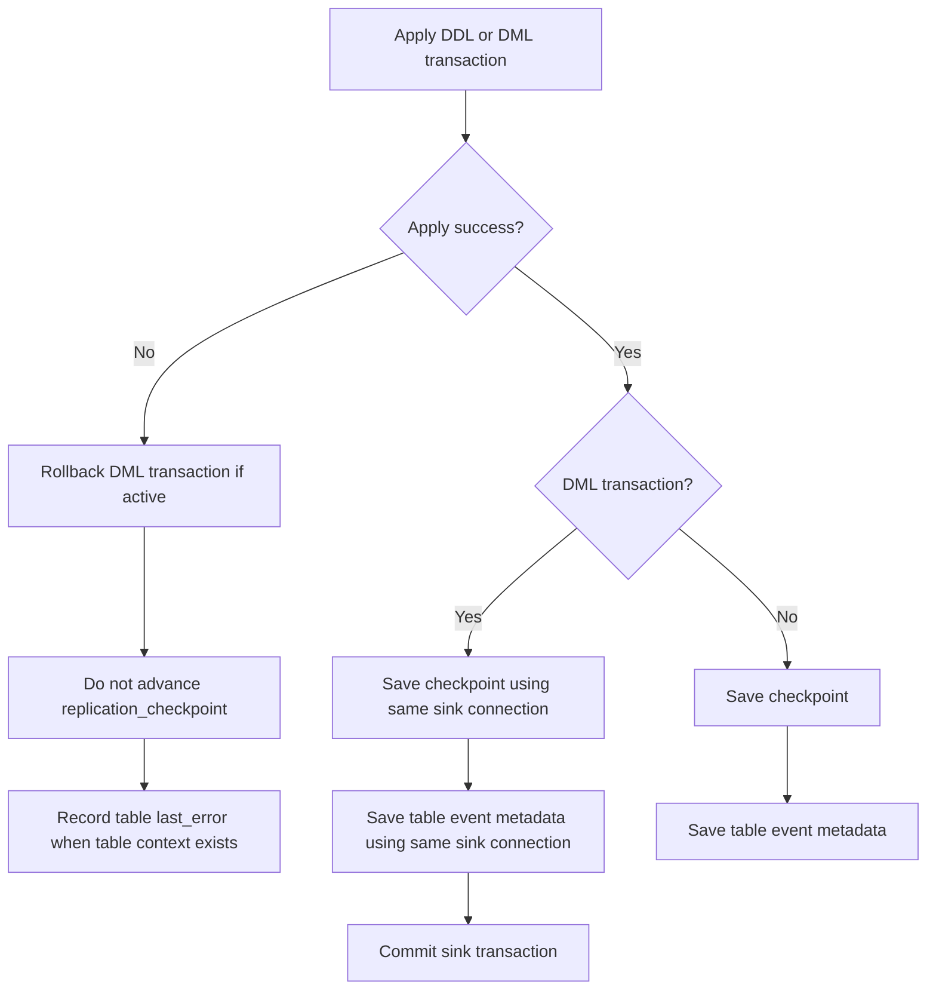

Why checkpointing is global:

- MySQL binlog order is global across tables.
- Replaying from a single ordered checkpoint avoids gaps between tables.
- Per-table metadata is observational and must not be used as the resume source.

If a checkpoint references a purged binlog file, the backend cannot safely continue from file/position. Recovery requires restoring the needed binlog/GTID history or rebuilding the sink from a fresh snapshot.

## 14. Verification Flow

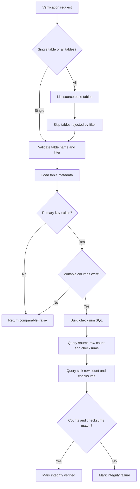

Checksum behavior:

- Verification compares source and sink row counts.
- It also compares `BIT_XOR(CRC32(...))` and `SUM(CRC32(...))`.
- Only replicated writable columns are included.
- Generated columns are excluded.
- Limited verification orders by primary key and checks the first `N` rows.

Limit tradeoff:

- Full verification scans the whole table on both databases.
- `limit` is faster for large tables, but it is a sample and not a full proof of equality.
- Tables without primary keys are not comparable for deterministic limited verification.

## 15. Pause and Resume Flow

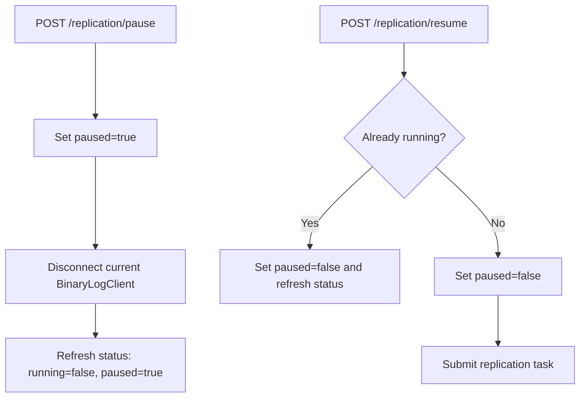

Pause does not delete checkpoint data. Resume continues from the last successfully saved checkpoint.

## 16. Retry and Fatal Error Flow

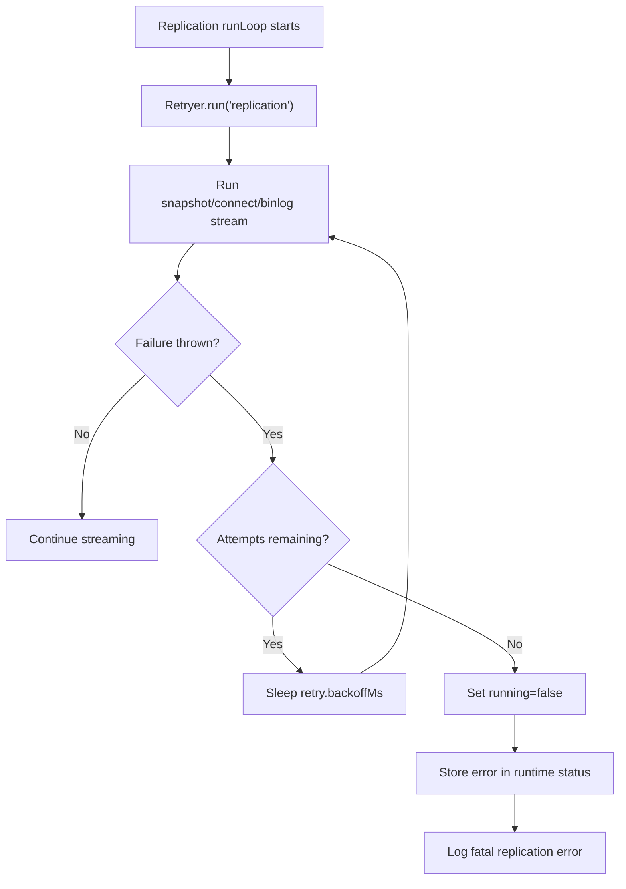

Retry defaults:

```yaml
retry:
  maxAttempts: 5
  backoffMs: 3000
```

Fatal failure behavior:

- Replication stops.
- The last successful checkpoint remains unchanged.
- A future resume retries from the old checkpoint.
- Table-level errors are recorded when the failing operation has table context.

## 17. Configuration Flow

Minimum source requirements:

```sql
log_bin = ON
binlog_format = ROW
binlog_row_image = FULL
server_id = unique
```

Typical replication configuration:

```yaml
source:
  url: jdbc:mysql://localhost:3309/thinkvitals?useSSL=false&allowPublicKeyRetrieval=true&serverTimezone=UTC
  username: root
  password: password

sink:
  url: jdbc:mysql://localhost:3310/thinkvitals?useSSL=false&allowPublicKeyRetrieval=true&serverTimezone=UTC
  username: root
  password: password

replication:
  serverId: 987654
  autoStart: false
  useGtid: true
  snapshotMode: initial
  ddlEnabled: true
  strictDdl: false
  dmlEnabled: true
  includeTables: []
  excludeTables:
    - flyway_schema_history
    - replication_checkpoint
    - replication_table_sync_metadata
  onDuplicateInsert: upsert
  requirePrimaryKey: true
```

Key defaults:

- `autoStart=false`: replication waits for an authenticated resume request.
- `snapshotMode=initial`: the backend snapshots when no checkpoint exists.
- `useGtid=true`: GTID is used when the checkpoint has a GTID set.
- `strictDdl=false`: relaxed sink schema is used by default.
- `onDuplicateInsert=upsert`: inserts are idempotent by default.
- `requirePrimaryKey=true`: updates and deletes require primary keys.

## 18. Operational Queries

Check the global checkpoint:

```sql
SELECT *
FROM replication_checkpoint
WHERE id = 1;
```

Check per-table snapshot and CDC state:

```sql
SELECT
  table_name,
  snapshot_status,
  snapshot_rows_copied,
  last_event_type,
  last_binlog_file,
  last_binlog_position,
  last_applied_time,
  last_error
FROM replication_table_sync_metadata
ORDER BY updated_at DESC;
```

Find failed tables:

```sql
SELECT table_name, snapshot_status, last_error, updated_at
FROM replication_table_sync_metadata
WHERE last_error IS NOT NULL
ORDER BY updated_at DESC;
```

Check backend status:

```bash
curl http://localhost:8080/health
curl -u admin:admin123 http://localhost:8080/replication/status
```

Pause and resume replication:

```bash
curl -u admin:admin123 -X POST http://localhost:8080/replication/pause
curl -u admin:admin123 -X POST http://localhost:8080/replication/resume
```

Run verification:

```bash
curl -u admin:admin123 "http://localhost:8080/replication/verify?table=user_model"
curl -u admin:admin123 "http://localhost:8080/replication/verify/all?limit=10000"
```

## 19. Production Notes

- Keep binlog retention longer than the maximum expected backend downtime.
- For large databases, binlog retention must also cover initial snapshot duration.
- Use GTID when the source supports it.
- Keep `replication.serverId` unique for every replicator instance that connects to the source.
- Keep source MySQL configured with `binlog_format=ROW` and `binlog_row_image=FULL`.
- Grant the source user `SELECT`, `RELOAD`, `LOCK TABLES`, `REPLICATION SLAVE`, and `REPLICATION CLIENT`.
- If the source user cannot run `FLUSH TABLES WITH READ LOCK`, snapshot consistency depends on whether source writes happen during copy.
- Use `strictDdl=true` only when the sink must enforce the same constraints and indexes as the source.
- Keep `strictDdl=false` for backup, reporting, or mirror sinks that prioritize resilient data sync.
- Do not run multiple backend instances against the same sink checkpoint unless leader election or external locking is added.
