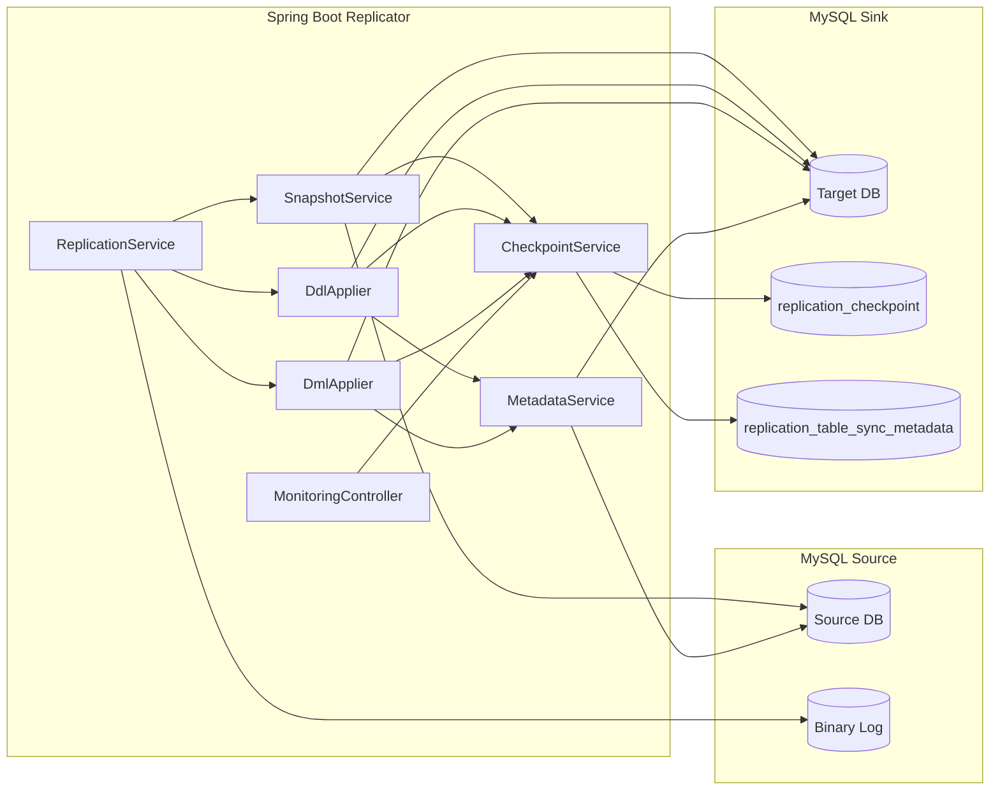
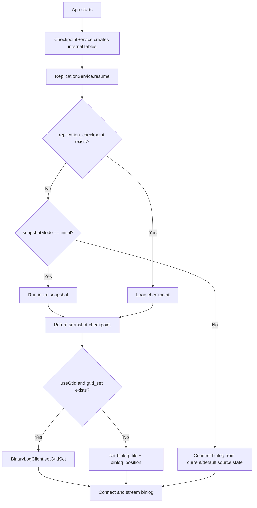
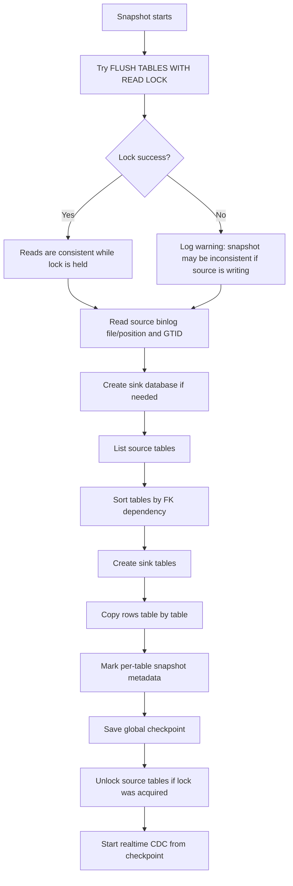
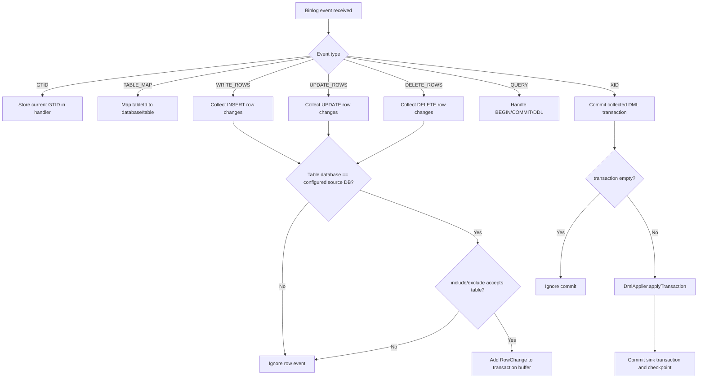
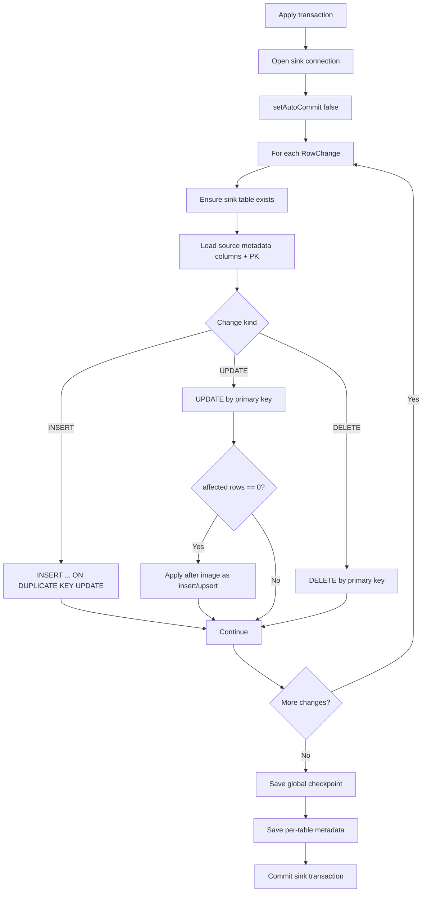
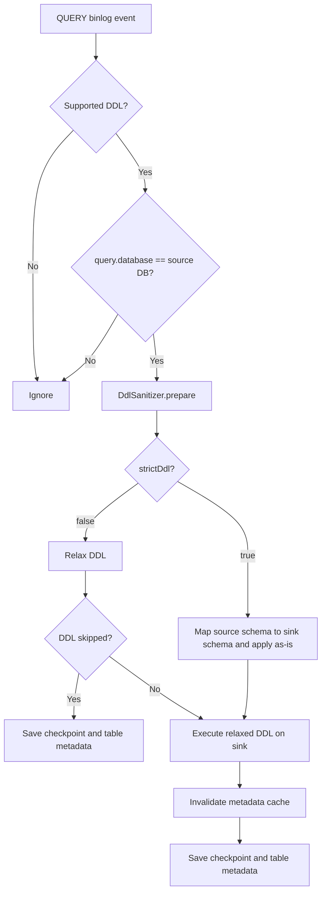
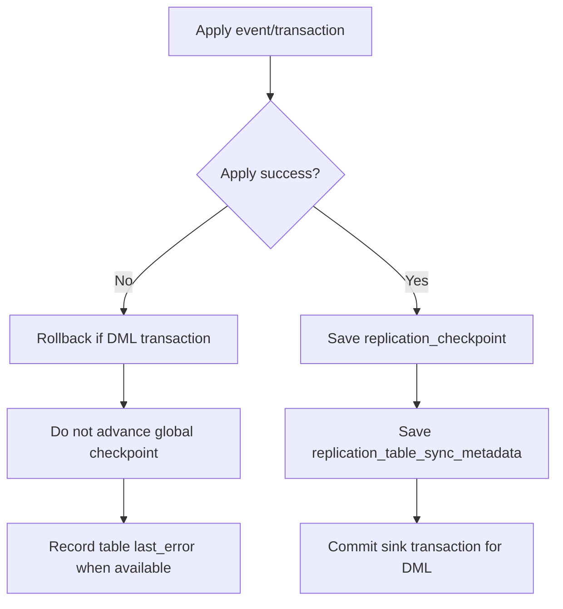
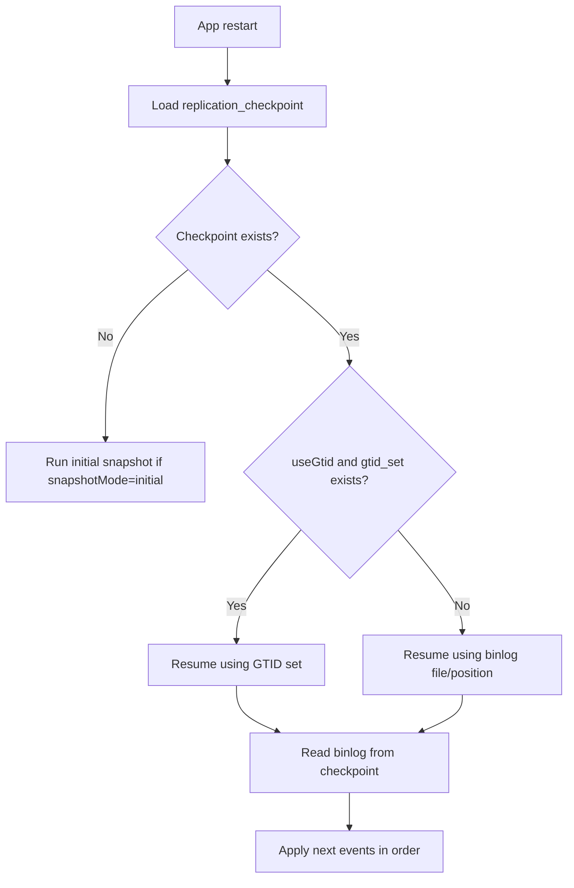
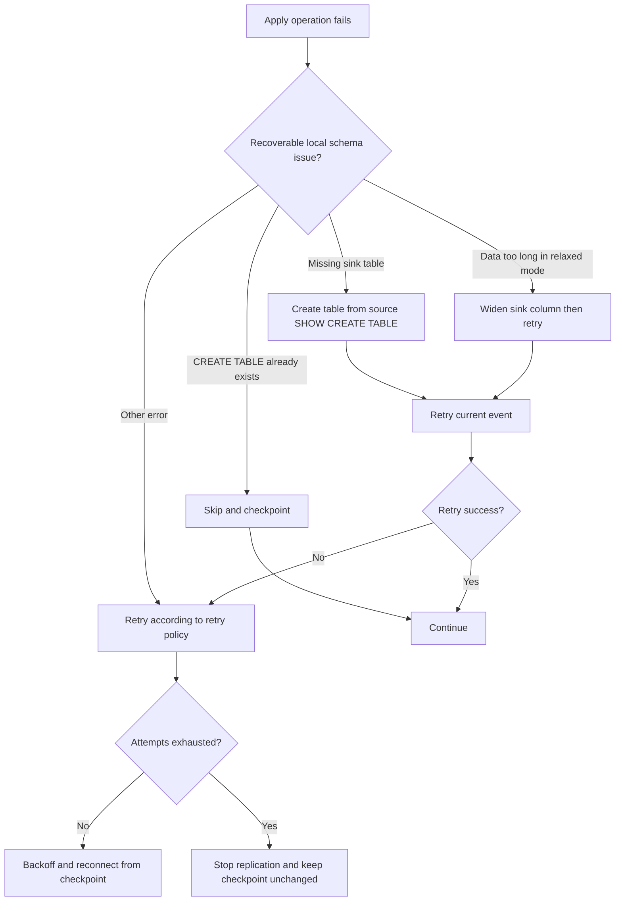

# MySQL Binlog Replicator - Flow & Operating Docs

Tài liệu này mô tả flow vận hành của app `mysql-binlog-replicator`: initial snapshot, realtime CDC, DDL/DML apply, checkpoint, metadata từng table, resume và error handling.

## 1. Mục tiêu

App replicate một MySQL source database sang một MySQL sink database bằng cách:

- Chạy initial snapshot khi sink chưa có checkpoint.
- Tạo schema sink từ source schema.
- Copy data hiện có từ source sang sink.
- Ghi checkpoint tại binlog position/GTID của snapshot.
- Tiếp tục đọc MySQL binlog để apply realtime DDL/DML.
- Resume từ checkpoint khi app restart.

App không dùng Kafka hoặc Debezium.

## 2. Component Overview



### Main Classes

- `ReplicationService`: start/pause/resume loop, connect binlog client, route events.
- `SnapshotService`: initial snapshot schema + data copy.
- `DdlApplier`: apply DDL from binlog to sink.
- `DmlApplier`: apply row-level INSERT/UPDATE/DELETE to sink.
- `MetadataService`: load source table metadata, ensure missing sink table, widen sink columns in relaxed mode.
- `DdlSanitizer`: strict/relaxed DDL transformation.
- `CheckpointService`: global checkpoint, per-table sync metadata, runtime status.
- `MonitoringController`: `/health`, `/replication/status`, pause/resume API.

## 3. Startup Flow



Default behavior:

- `replication.snapshotMode` defaults to `initial`.
- `replication.strictDdl` defaults to `false`.
- `replication.requirePrimaryKey` defaults to `true`.
- `replication.onDuplicateInsert` defaults to `upsert`.

## 4. Initial Snapshot Flow



Snapshot table handling:

1. `SnapshotService` lists base tables in source database.
2. Tables are ordered by foreign-key dependency so parent tables are created/copied before child tables.
3. Each accepted table is created on sink.
4. Each accepted table is copied using `REPLACE INTO`.
5. `replication_table_sync_metadata` is updated:
   - `snapshot_status = RUNNING` before copy.
   - `snapshot_status = COMPLETED`, `snapshot_rows_copied = <count>` after copy.
   - `snapshot_status = FAILED`, `last_error = <error>` if copy fails.

## 5. Realtime CDC Flow



Important behavior:

- Row events from other databases are ignored.
- Single-thread apply preserves binlog order.
- DML changes are buffered until commit.
- Sink transaction is committed only after all row changes and checkpoint update succeed.
- If apply fails, sink transaction is rolled back and checkpoint is not advanced.

## 6. DML Apply Flow



### INSERT

Default mode:

```sql
INSERT INTO sink_table (...) VALUES (...)
ON DUPLICATE KEY UPDATE ...
```

This makes restart/retry safer when the same event is replayed.

### UPDATE

Default:

```sql
UPDATE sink_table
SET non_pk_col = ?
WHERE pk = ?
```

If the row does not exist on sink, app applies the `after` image as insert/upsert.

### DELETE

Default:

```sql
DELETE FROM sink_table WHERE pk = ?
```

If row does not exist on sink, app logs warning and continues.

## 7. DDL Apply Flow



Supported DDL:

- `CREATE TABLE`
- `ALTER TABLE`
- `DROP TABLE`
- `RENAME TABLE`
- `TRUNCATE TABLE`
- `CREATE INDEX`
- `DROP INDEX`

## 8. Strict vs Relaxed DDL

### strictDdl=true

DDL is applied closely to source after schema mapping.

Use this when the sink must preserve source constraints/indexes exactly.

Tradeoff:

- Foreign-key dependency and existing sink objects can block apply.
- DDL failures stop the pipeline.
- Checkpoint is not advanced on failure.

### strictDdl=false

This is the default.

Sink DDL is intentionally relaxed to make replication resilient:

- `CREATE TABLE` keeps writable columns and `PRIMARY KEY`.
- Non-primary-key text columns are widened to `longtext`.
- Non-primary-key binary/blob columns are widened to `longblob`.
- Generated columns are skipped.
- `DEFAULT`, `ON UPDATE`, `AUTO_INCREMENT`, `NOT NULL`, per-column charset/collation and comments are removed.
- Foreign keys, unique keys, secondary indexes, fulltext/spatial indexes and checks are removed.
- Table options such as `ENGINE`, `AUTO_INCREMENT`, default charset/collation are removed.
- Index/constraint-only DDL is skipped and checkpointed.
- Column-changing DDL is still applied.

This mode is useful for a backup/reporting sink where the goal is easy data sync, not enforcing the full source schema.

## 9. Checkpoint Flow



Global checkpoint table:

```sql
replication_checkpoint
```

Purpose:

- Single ordered resume point for the full source database.
- Stores binlog file/position or GTID.
- Updated only after successful apply.

Per-table metadata table:

```sql
replication_table_sync_metadata
```

Purpose:

- Operational visibility per table.
- Shows snapshot status, rows copied, last table-level event, last error.
- Does not control resume ordering.

Resume always uses `replication_checkpoint`, not the per-table metadata table.

## 10. Resume Flow



If binlog needed by checkpoint has been purged, app cannot safely continue without data loss. The correct recovery is to reset sink/checkpoint and run a fresh initial snapshot, or restore a source with the required binlog/GTID history.

## 11. Error Handling



Retry config:

```yaml
retry:
  maxAttempts: 5
  backoffMs: 3000
```

On fatal failure:

- App stops replication.
- Global checkpoint is not advanced.
- Per-table `last_error` is updated when table context is available.
- Restart/retry will replay from the old checkpoint.

## 12. Filtering

```yaml
replication:
  includeTables: []
  excludeTables:
    - flyway_schema_history
    - replication_checkpoint
```

Rules:

- If `includeTables` is empty, all source tables are included unless excluded.
- If `includeTables` has values, only listed tables are included.
- `excludeTables` wins over include/default.
- Internal tables should be excluded if they exist in source.

Recommended excludes:

```yaml
replication:
  excludeTables:
    - flyway_schema_history
    - replication_checkpoint
    - replication_table_sync_metadata
```

## 13. Operational Queries

Check global checkpoint:

```sql
SELECT *
FROM replication_checkpoint
WHERE id = 1;
```

Check per-table snapshot and CDC state:

```sql
SELECT
  table_name,
  snapshot_status,
  snapshot_rows_copied,
  last_event_type,
  last_binlog_file,
  last_binlog_position,
  last_applied_time,
  last_error
FROM replication_table_sync_metadata
ORDER BY updated_at DESC;
```

Find failed tables:

```sql
SELECT table_name, snapshot_status, last_error, updated_at
FROM replication_table_sync_metadata
WHERE last_error IS NOT NULL
ORDER BY updated_at DESC;
```

Check API status:

```bash
curl http://localhost:8080/health
curl http://localhost:8080/replication/status
```

Pause/resume:

```bash
curl -X POST http://localhost:8080/replication/pause
curl -X POST http://localhost:8080/replication/resume
```

## 14. Production Notes

- Binlog retention must be longer than expected app downtime.
- For large databases, binlog retention should cover initial snapshot duration plus operational buffer.
- Use GTID when source supports it.
- Keep `serverId` unique per replicator instance.
- Keep `binlog_format=ROW` and `binlog_row_image=FULL`.
- If source user cannot run `FLUSH TABLES WITH READ LOCK`, snapshot may be inconsistent while source writes continue.
- For strict schema replicas, use `strictDdl=true`.
- For easy backup/reporting sync, keep default `strictDdl=false`.
- Do not run multiple app instances applying to the same sink/checkpoint unless leader election is added.

